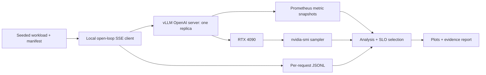

# SLO-aware vLLM Scheduling Optimization

## Decision and scope

Choose a scheduler configuration that maximizes successful requests per second satisfying a **predeclared per-request** latency SLO, on one RTX 4090 and Qwen2.5-7B-Instruct. This is a controlled single-GPU experiment, not a claim of production-scale availability or a new scheduling algorithm. The contribution is measurement correctness, reproducibility, constrained configuration selection and operational integration.

## Architecture

The existing Vercel → Render → Ray Serve/vLLM application is a separate demo path. Experimental traffic runs within the GPU Pod to avoid WAN jitter, response caching and gateway scheduling confounds. Public smoke tests are reported separately. vLLM's standard OpenAI server provides exact usage, health, and engine metrics; Ray's autoscaling is deliberately excluded from the single-replica comparison.

## Hypotheses

H1: Increasing `max_num_seqs` from 1 improves throughput under equal offered load, until compute/KV constraints dominate. H2: Increasing token budget trades prefill work against decode responsiveness. H3: The highest throughput configuration need not maximize SLO goodput. No positive improvement is assumed in advance; a negative or inconclusive result is valid.

`max_num_seqs=1` is a serial sequence baseline, **not** an engine with all batching or GPU optimizations disabled. Gateway micro-batching groups HTTP-level work; continuous batching schedules active sequences at engine iterations. Only the latter changes the GPU scheduling boundary in this experiment. Prefix caching is disabled for this scheduling study; it requires its own cache-hit-controlled experiment.

## Controls and search

- Pin runtime to the installed vLLM 0.29.0; record Python, torch, CUDA/driver, GPU, package freeze and exact server arguments.
- Same model revision/cache, dtype bfloat16, GPU memory fraction 0.9, max model length 4096, seed 17, no quantization.
- Fixed input token IDs generated deterministically, 256 prompt tokens and exactly 128 completion tokens (`ignore_eos=true`). Record workload SHA256. Synthetic workload measures scheduling, not answer quality.
- Screening candidates: sequence limits 1,8,16,32,64; token budgets 2048,4096,8192. Use a bounded first pass, record any untested cells rather than imply full grid coverage.
- Same arrival rate and request count across candidates; no client semaphore concealing overload. Arrivals use a seeded Poisson process. Record client dispatch lateness.
- Warm up separately; initialization/compilation excluded. Screening is exploratory. Freeze a selected candidate, then run baseline and selected configurations at least three independent repetitions. Pair seeds and alternate configuration order where practical. Report each repeat and aggregate; small-sample tail percentiles are descriptive, not robust production estimates.
- Initial SLO: TTFT ≤ 1 second AND E2E ≤ 10 seconds. Timeout 60 seconds. Screening arrival rate 2 requests/s, formal rate fixed before formal runs. Do not retune SLO after looking at results.
- GPU is rented; cap initial screening to five sequence candidates at token budget 4096, then two extra budgets for the strongest sequence candidate. Full 15-cell sweep remains available but is not required to claim the tested comparison.

## Measurement contract

Use monotonic client timestamps. TTFT is first nonempty content arrival minus dispatch. E2E includes the stream's final usage/DONE. TPOT proxy = (last content arrival − first content arrival)/(completion tokens − 1); report null for ≤1 token. SSE events are **not tokens**. This is client-observed average output-token time, not an exact inter-token latency distribution. Counts must come from final server usage; missing usage, truncated streams, incorrect output length and malformed payloads fail validation rather than falling back to whitespace counts.

Throughput = successful exact output tokens / measured run wall time. Request throughput = successful requests / wall time. Goodput = successful requests satisfying both per-request SLOs / wall time. Report failures as part of all attempted requests; never drop them from the denominator. Report p50/p95/p99 TTFT and E2E, p50/p95 TPOT over valid successes with sample size. End-to-end duration includes drain time. Dispatch lateness reveals load-generator saturation.

Sample nvidia-smi utilization and memory once per second. Capture `/metrics` before/after each run; derive preemption counter deltas only if present. Preserve KV-cache occupancy samples if exposed. Missing metrics are null/unavailable, not zero. OOM is detected from server logs and failed requests; lack of log evidence is not proof of zero OOM. Utilization is a sampled device metric, not occupancy or kernel efficiency.

## Reliability and safety

No production keys in artifacts. Bind experimental server to loopback. Keep existing public service configuration and PID snapshot, stop only its identified driver/deployment during the test window, and restore it afterward. Do not run two 7B engines on a single 24GB GPU. Abort search on repeated OOM, missing GPU, lost SSH or disk pressure. Preserve completed JSONL records after failures. Do not automatically buy GPU capacity or terminate the Pod. Public RunPod URLs and billing state can change; demo video is timestamped evidence, not a permanent uptime promise.

## Deliverables and acceptance

CPU parser/statistics tests and green CI; exact-count GPU smoke test; raw records and environment manifest; candidate/repeat table; plots of throughput, goodput and latency; reproducible commands; selected configuration justified by goodput rather than a cherry-picked maximum. A resume claim is permitted only for the tested workload, hardware and comparison, after raw-data validation. Frontend walkthrough video is evidence of application behavior, not benchmark evidence.

## References

- https://docs.vllm.ai/en/latest/configuration/optimization.html
- https://docs.vllm.ai/en/latest/configuration/engine_args.html
- https://docs.vllm.ai/en/latest/serving/openai_compatible_server.html

Latest documentation may differ from the pinned runtime; installed CLI help and recorded launch command are authoritative for reproducibility.
