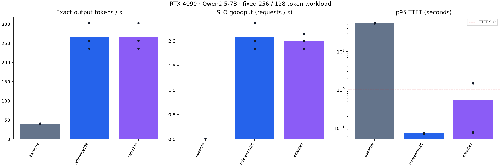

# Experiment results

Each row is a completed run; failures remain in the denominator. See raw JSONL and manifests.

| Run | Seqs | Budget | Success / attempted | Tokens/s | Goodput | p95 TTFT s | p95 E2E s | GPU mean % |
|---|---:|---:|---:|---:|---:|---:|---:|---:|
| budget-s8-t2048/seed-17 | 8 | 2048 | 64/64 | 257.49 | 2.012 | 0.080 | 2.208 | 100.0 |
| budget-s8-t8192/seed-17 | 8 | 8192 | 64/64 | 257.41 | 2.011 | 0.083 | 2.206 | 100.0 |
| formal-baseline/seed-101 | 1 | 4096 | 39/128 | 39.22 | 0.008 | 53.795 | 55.787 | 99.6 |
| formal-baseline/seed-102 | 1 | 4096 | 39/128 | 41.02 | 0.008 | 56.566 | 58.557 | 99.8 |
| formal-baseline/seed-103 | 1 | 4096 | 36/128 | 41.15 | 0.009 | 55.905 | 57.897 | 99.8 |
| formal-reference128/seed-101 | 128 | 4096 | 128/128 | 236.21 | 1.845 | 0.071 | 2.204 | 100.0 |
| formal-reference128/seed-102 | 128 | 4096 | 128/128 | 256.84 | 2.007 | 0.073 | 2.212 | 98.4 |
| formal-reference128/seed-103 | 128 | 4096 | 128/128 | 303.09 | 2.368 | 0.076 | 2.354 | 98.1 |
| formal-selected/seed-101 | 8 | 2048 | 128/128 | 236.19 | 1.845 | 0.077 | 2.215 | 100.0 |
| formal-selected/seed-102 | 8 | 2048 | 128/128 | 256.91 | 2.007 | 0.076 | 2.219 | 100.0 |
| formal-selected/seed-103 | 8 | 2048 | 128/128 | 303.13 | 2.146 | 1.464 | 3.626 | 98.1 |
| screen-s1-rerun/seed-17 | 1 | 4096 | 45/64 | 63.42 | 0.011 | 59.725 | 61.716 | 99.9 |
| screen-s16-t4096/seed-17 | 16 | 4096 | 64/64 | 257.48 | 2.012 | 0.075 | 2.208 | 100.0 |
| screen-s32-t4096/seed-17 | 32 | 4096 | 64/64 | 257.33 | 2.010 | 0.072 | 2.208 | 100.0 |
| screen-s64-t4096/seed-17 | 64 | 4096 | 64/64 | 257.50 | 2.012 | 0.076 | 2.204 | 100.0 |
| screen-s8-t4096/seed-17 | 8 | 4096 | 64/64 | 257.46 | 2.011 | 0.078 | 2.203 | 98.9 |

Percentiles on small samples are descriptive. TPOT is a client-observed per-request average, not an inter-token histogram. Missing GPU/KV metrics are not zero.

## Formal repeat means

Bars show means; dots show individual repeats. Grouped execution order can confound thermal/time effects. Three repeats do not establish production tail guarantees.

- formal-baseline: 40.47 tokens/s; 0.008 good requests/s; mean per-run p95 TTFT 55.422s.
- formal-reference128: 265.38 tokens/s; 2.073 good requests/s; mean per-run p95 TTFT 0.073s.
- formal-selected: 265.41 tokens/s; 1.999 good requests/s; mean per-run p95 TTFT 0.539s.
- Selected output-throughput change versus formal-baseline: 555.89%.
- Selected output-throughput change versus formal-reference128: 0.01%.

The sequence-limit-1 baseline is deliberately serial. Its improvement is not an improvement over the original 128-sequence integration. Inspect the 128 reference separately before making any incremental tuning claim.
